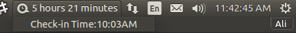

# Check-in/out Indicator 
What's the first thing you do when you reach your office? Check-in, right?
The problem is, I always forget the exact time I checked-in and then I keep wondering how early I can leave :stuck_out_tongue_winking_eye:

It's a small utility, for Ubuntu users, to help you remember what time did you check-in, by looking at your computer's uptime, and how much more time you have to spend. Neat, huh?



Yep, 10:03AM, that's late :sob:

## How to run?

It's pretty simple!


```
$ cd ~
$ git clone
$ python checkinout-indicator/checkinout-indicator.py
```

## Autostart

Create a file `~/.config/autostart/checkinout-indicator.desktop` with the following content:

```
[Desktop Entry]
Name=Check-in/out Indicator
Type=Application
Exec=python /home/[username]/checkinout-indicator/checkinout-indicator.py
Hidden=false
NoDisplay=false
X-GNOME-Autostart-enabled=true
```

Don't forget to replace `[username]`!

## Bugs?
I'm not a Python developer, and it's just a fun project.
Feel free to create issues and submit PRs, I'll be more than happy to entertain them :smile:
